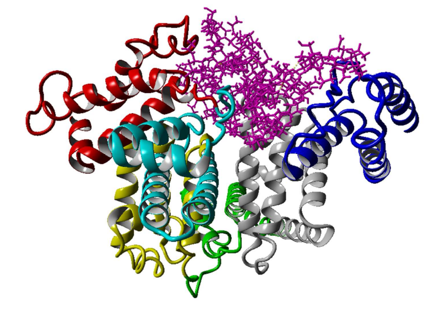
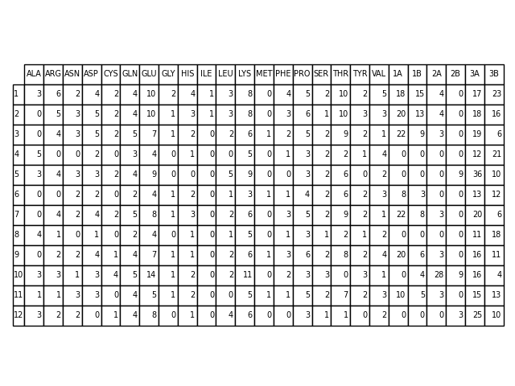

# Molecular-dynamics

This project is focused on using data from molecular dynamics simulations 
acquired during my work in academia and published in https://www.mdpi.com/1422-0067/22/22/12360

## Abstract

Molecular dynamics is a crucial technique for understanding the dynamics of intermolecular 
forces and their resulting structural implications. Albumin is a crucial molecule in many 
biological systems. Its electrostatic attributes, pivotal for forming molecular complexes, 
are intricately linked to factors such as pH variations, solvation, and the presence of ions. 
Particularly within the synovial fluid, exploring the potential interactions between albumin 
and hyaluronate becomes pertinent, considering the impacts of solution composition.

This investigation focused on exploring how Na+, Mg2+, and Ca2+ ions influence interactions 
between human serum albumin and hyaluronan through molecular dynamics simulations. 
The findings revealed that divalent cations, notably Ca2+, predominantly enhance the affinity 
between hyaluronan and albumin. This enhancement is attributed to charge compensation mechanisms 
within negatively charged hyaluronan and albumin. Additionally, the study delved into characterizing 
the most probable binding sites structurally and energetically. These identified regions exhibit local 
positive charges, facilitating hyaluronate binding through direct and water-mediated interactions.


Structure of human serum albumin with different coloring for the different HSA subdomains:
IA—red; IB—cyan; IIA—yellow; IIB—green; IIIA—grey; IIIB—blue. Hyaluronate is colored
pink. The figure represents one of many structures of the HAS–hyaluronate complex. This particular
complex is referred to as complex number 1 in Table 1.

## Features

- **File Reading and Transformation**: The `read_and_transform` function reads data files containing hydrogen bonds and ionic interactions, transforming them into a more usable format.
- **Interaction Analysis**: The `read_file_show_interaction` function reads data from multiple files for a given ion type, extracts relevant information, and calculates the mean interactions over time.
- **Data Filtering**: The `count_rows_with_conditions` function filters interaction data based on specific conditions to focus on intermolecular interactions.
- **Visualization**: The `main` function generates bar plots to visualize the number of hydrogen bonds for different ion types over a specific time period.

## Installation

1. Clone this repository to your local machine.
2. Ensure you have Python 3.x installed.
3. Install the required dependencies using pip:

    ```
    pip install pandas matplotlib numpy
    ```

## Usage

1. Ensure your data files are organized according to the specified structure.
2. Modify the file paths and parameters in the code as needed.
3. Run the `main` function to generate visualizations.

## File Structure

- **read_data.py**: Contains functions for reading, processing, and analyzing molecular dynamics data.
- **Files/**:
  - *Data files*: Contains the input data files for analysis.
  - *HBonds_vs_site.png*: Output visualization of hydrogen bond analysis.

## Contributions
Original paper contributors
Piotr Bełdowski, Maciej Przybyłek, Przemysław Raczynski, Andra Dedinaite, Krzysztof Górny,
Florian Wieland, Zbigniew Dendzik, Alina Sionkowska and Per M. Claesson
Project contributor
Paweł Kalicki
Contributions to this project are welcome. If you find any issues or have suggestions for improvements, please feel free to open an issue or submit a pull request.

## License

This project is licensed under the MIT License. See the [LICENSE](LICENSE) file for details.

